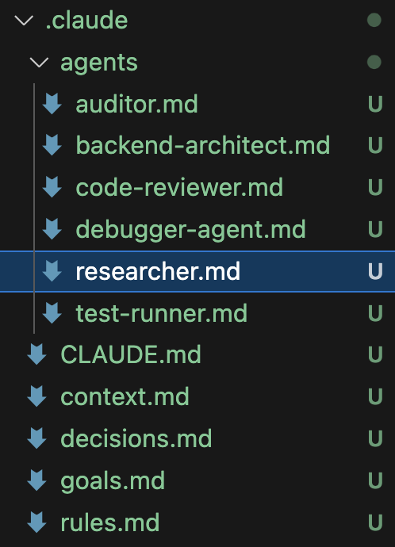

# Agent-izing a real Project: Hands-on Practice

## Intro
The abilities of current LLMs in Software Engineering (SE) are amazing, and
the coming of AI Agents and such tools as MCP pushes it forward to new levels of proficiency,
allowing to perform complex human-like iterations automatically.

The paradigm of SE is changing, so we should adapt and become the creators of tech products,
not only developers.

## Overview
This hands-on practice is designed to guide you through the process of transforming 
a traditional full-stack application (Python backend + React frontend) 
into an AI-friendly project that can be effectively developed with the assistance of AI agents. 
This process, which we call "agent-ization," involves restructuring code, 
adding documentation, rules and guard-rails for AI agents 
and implementing specific patterns that make your codebase more amenable to AI-assisted development.

All the theory and simple tasks are here: [futurecoding.ai](https://futurecoding.ai)

## Learning Objectives
By the end of this course, you will be able to:
- Understand the principles of AI-friendly code organization
- Implement documentation patterns that enhance AI comprehension
- Restructure a full-stack application to be more modular and agent-friendly
- Create effective prompting strategies for AI-assisted development
- Develop a workflow that leverages AI agents throughout the development lifecycle

## Prerequisites
- Basic understanding of Python and programming
- Familiarity with full-stack web development concepts
- Experience with GitHub
- Access to some agentic IDE (e.g., PyCharm, Cursor or VS Code)

## Project Structure
You will be working with a real-world full-stack application that includes:

### Backend (Python)
- Django-based project
- PostgreSQL and Redis as databases
- Authentication and authorization
- A lot of parts, including users, courses, notifications and admin-panel

### Frontend (React)
- JavaScript/TypeScript frontend
- API integration
- Various UI components and utilities

## Agent-ization Process

### Phase 1: Code Analysis and Documentation
1. **Repository Analysis**
   - Clone the provided repository
   - Analyze the current structure and identify key parts
   - Document the existing architecture and data flow

2. **Documentation Enhancement**
   - Add comprehensive docstrings to all Python functions and classes
   - Create JSDoc comments for React components and functions
   - Develop a high-level architecture document that explains system interactions

### Phase 2: Restructuring for AI Readability
1. **Backend Restructuring**
   - Implement a clear separation of concerns (routes, services, models)
   - Create explicit interfaces between components
   - Add type hints to Python code for better AI understanding
   - Implement consistent error handling patterns

2. **Frontend Restructuring**
   - Organize components into logical folders
   - Implement a consistent state management approach
   - Create reusable UI components with clear props interfaces

### Phase 3: Implementing AI-Friendly Patterns
1. **Testing Infrastructure**
   - Add unit tests for backend services
   - Implement component tests for React elements
   - Create integration tests and auto QA for critical user flows
   - Document testing strategies and patterns

2. **AI Collaboration Points**
   - Add "AI collaboration comments" at strategic points in the code
   - Create template prompts for common development tasks
   - Document the reasoning behind architectural decisions

### Phase 4: AI-Assisted Development Workflow
1. **Setting Up Development Environment**
   - Configure your IDE for AI integration
   - Set up version control with AI-friendly commit messages
   - Create a development workflow that incorporates AI feedback

2. **Implementing New Features with AI**
   - Use AI to help design and implement a new feature
   - Document the prompting strategies used
   - Refine the approach based on results

3. **Debugging with AI Assistance**
   - Develop techniques for effective AI-assisted debugging
   - Create templates for bug reports that maximize AI utility
   - Implement a process for AI-assisted code reviews

## Deliverables
1. Agent-ized full-stack application repository
2. Documentation of the agent-ization process
3. Examples of successful AI interactions with your codebase
4. Reflection on the effectiveness of AI-assisted development
5. Presentation of a feature implemented with AI assistance

## Resources
- [futurecoding.ai](https://futurecoding.ai)
- [AI-zation in startup (in Russian)](https://www.youtube.com/watch?v=YyJr8y4uLo8&t=8037s)
- [Repomix](https://www.youtube.com/watch?v=PC5y-IyL9SE&t=4s)
- [Browser MCP](https://www.youtube.com/watch?v=eD5SUj5qqgI) and [Official Figma MCP](https://www.youtube.com/watch?v=yO3Wr7DEWF0)
- [Post from Armin Ronacher (creator of Flask)](https://lucumr.pocoo.org/2025/6/12/agentic-coding/)
- 

## Getting Started
1. Fork the starter repository from [GitHub](https://github.com/avalur/avalur.github.io/blob/master/ai-assisted-programming/)
2. Follow the setup instructions in the repository's README
3. Complete each phase of the agent-ization process

Happy coding and agent-izing!
